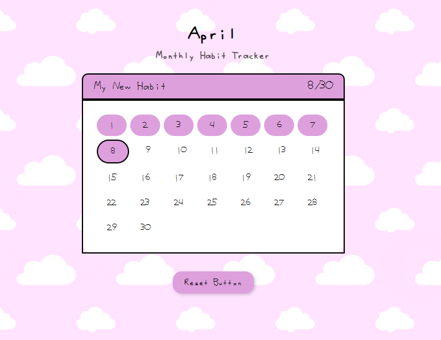

# 🌸 Habit Tracker

## About

**Habit Tracker** is a simple and cute monthly habit tracking app built with HTML, CSS, and JavaScript.

It allows you to:
- Set your custom habit for the current month;
- Click on the calendar days to mark your progress;
- View your completed days count in real-time;
- Save progress locally using `localStorage`;
- Reset all progress with a single click.

This project features:
- A pastel-themed user interface with a soft background and rounded elements;
- Dynamic calendar that updates based on the current month and date;
- Interactive elements with smooth feedback for a pleasant user experience.
